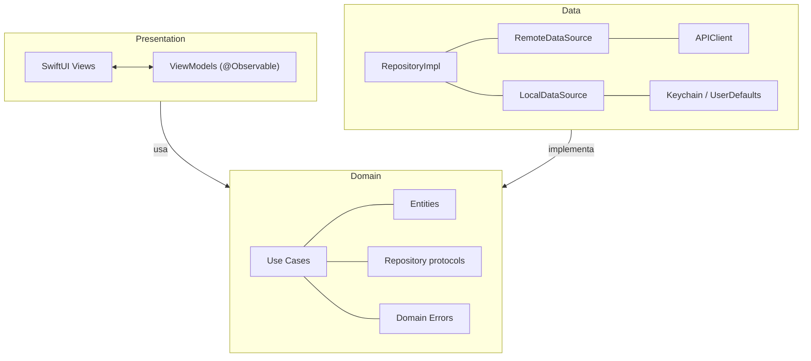
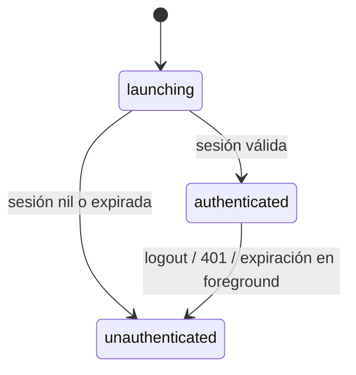
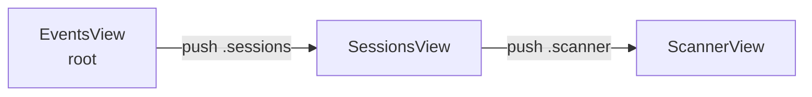
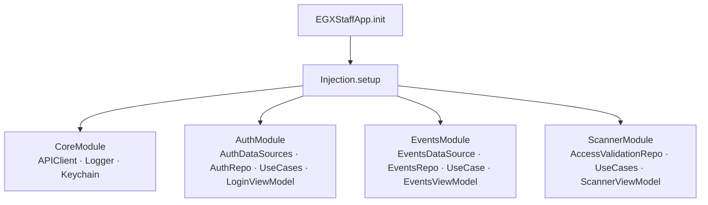

# Arquitectura

## Capas

Clean Architecture estricta. Dependencias unidireccionales: Presentation → Domain ← Data.



**Regla absoluta:** Domain no importa ni SwiftUI ni Foundation más allá de lo necesario. Data no importa Presentation.

---

## AuthState — estado de autenticación global



`AuthState` vive en `AppViewModel`. `AppRootView` enruta entre `LoginView` y `EventsView` según la fase. Detalles del flujo de expiración en [docs/features/auth.md](features/auth.md).

---

## Patrón de ViewModels (MVVM-I)

`@MainActor @Observable` con propiedades planas (nunca nested State struct) y un único método de entrada `handle(_:)`.

```swift
@MainActor @Observable final class EventsViewModel {
    private(set) var events: [Event] = []
    private(set) var status: Status = .idle
    var query: String = ""                    // binding directo desde la View

    enum Status: Equatable { case idle, loading, loaded, failure(String) }

    func handle(_ intent: EventsIntent) {
        switch intent {
        case .load: Task { await load() }
        case .selectEvent(let id): selectedEventId = id
        // ...
        }
    }
}
```

**Por qué flat props:** `@Observable` trackea a nivel de stored property. Un nested struct `state` invalida toda view que accede a `state` ante cualquier mutación, incluso en propiedades que no usa. Ver [ADR 001](adr/001-observable-flat-state.md).

**Concurrencia con frameworks Obj-C (`@preconcurrency`):** Frameworks como AVFoundation exponen tipos no-`Sendable` (`AVCaptureSession`, `AVCaptureMetadataOutput`). Usar `@preconcurrency import AVFoundation` para suprimir warnings de Sendable en closures. Callbacks de delegates que acceden a propiedades `@MainActor` deben hacer hop explícito: `Task { @MainActor in ... }`.

---

## Navegación

`AppRouter` inyectado como `@Environment`. Stack tipado `[Route]`.

```swift
@Observable final class AppRouter {
    var path: [Route] = []
}

enum Route: Hashable {
    case sessions
    case scanner(sessionId: String, eventId: String)
}
```



API del router: `push(_:)`, `pop()`, `popToRoot()`. Ver [ADR 003](adr/003-typed-route-enum.md) para el por qué de `[Route]` sobre `NavigationPath`.

---

## Inyección de dependencias

ServiceLocator GetIt-style. Instancia global `sl`. Ver [ADR 004](adr/004-service-locator-vs-environment.md).



```swift
sl.registerLazySingleton(T.self) { ... }  // una sola instancia, lazy
sl.registerFactory(T.self) { ... }         // nueva instancia por acceso
sl.registerSingleton(T.self, instance: x)  // instancia ya creada

// Resolución en init() de la View:
self._viewModel = State(initialValue: sl())
```

**Convención:** `@Environment` para `AppRouter` (fluye por el árbol de views). `sl` para ViewModels y use cases.

---

## Archivos clave

| Archivo | Responsabilidad |
|---------|-----------------|
| `App/AuthState.swift` | Estado global de la app |
| `App/AppViewModel.swift` | Session bootstrap, revalidación, logout |
| `App/AppRootView.swift` | Enrutamiento por AuthState |
| `Core/DI/ServiceLocator.swift` | Contenedor DI |
| `Core/DI/Injection.swift` | Orquestación del setup |
| `Core/Navigation/AppRouter.swift` | Stack de navegación tipado |
