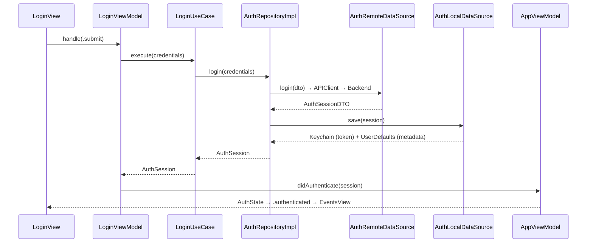
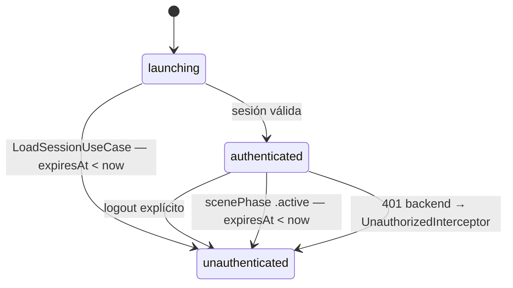

# Feature: Auth

Gestiona login, almacenamiento seguro de sesión y detección de expiración.

## Endpoint

```
POST /api/v1/mobile
Body:     { device_name, password }
Response: { token, email, id, duration }
```

---

## Flujo de login



---

## Expiración de sesión

Tres capas de detección:



1. **Al abrir la app** — `LoadSessionUseCase` compara `expiresAt` con `Date.now`. Si expiró, limpia Keychain y fuerza re-login.
2. **Al volver al frente** — `AppViewModel.revalidateSession()` re-chequea cuando `scenePhase == .active`.
3. **En 401 del backend** — `UnauthorizedInterceptor` publica `Notification.egxSessionExpired`. `AppViewModel` observa, hace logout y muestra alerta.

---

## Almacenamiento

| Store | Keys |
|-------|------|
| Keychain | `access_token`, `refresh_token`, `user_id` |
| UserDefaults | `email`, `full_name`, `role`, `expires_at` (timestamp Unix) |

---

## Archivos clave

| Archivo | Responsabilidad |
|---------|-----------------|
| `Auth/Domain/Entities/AuthSession.swift` | Entidad de sesión |
| `Auth/Domain/UseCases/LoginUseCase.swift` | Orquesta login |
| `Auth/Domain/UseCases/LoadSessionUseCase.swift` | Valida sesión al launch |
| `Auth/Domain/UseCases/LogoutUseCase.swift` | Limpia Keychain y estado |
| `Auth/Data/AuthRepositoryImpl.swift` | Implementación concreta |
| `Auth/Data/DataSources/AuthLocalDataSource.swift` | Keychain + UserDefaults |
| `Auth/Data/DataSources/AuthRemoteDataSource.swift` | Llamada al backend |
| `Auth/Application/Login/LoginViewModel.swift` | Estado y lógica de presentación |
