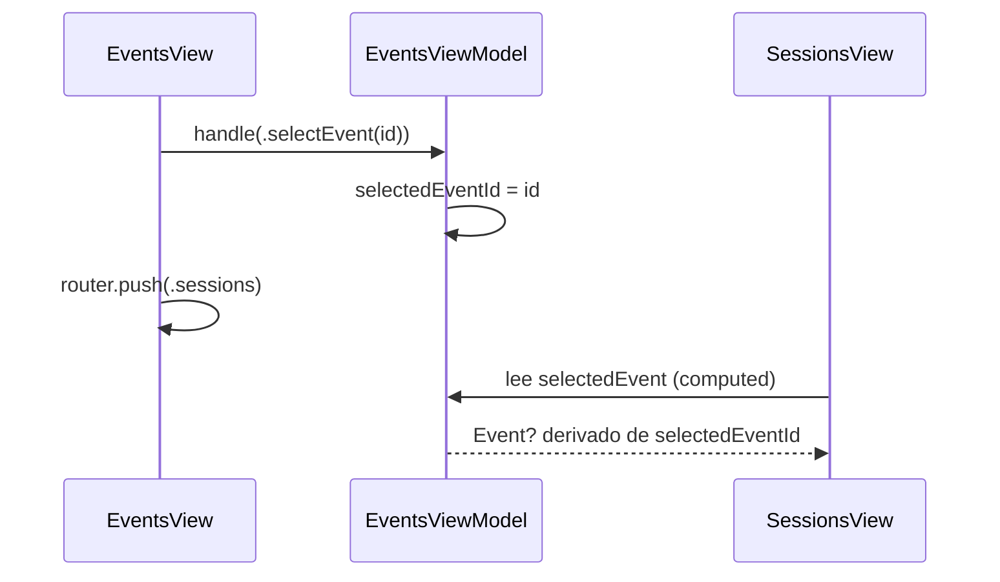

# Feature: Events

Lista los eventos asignados al operador y sus sesiones.

## Endpoint

```
GET /api/v1/events   (requiere auth)
```

---

## Modelo de dominio

```swift
Event
├── id: String
├── name: String
├── summary: String
├── logoURL: URL?
├── status: String         // inProgress, assigned, finished
└── sessions: [EventSession]

EventSession
├── id: String
├── name: String
├── accessWindowStart/End  // ventana en que se puede escanear
└── sessionStart/End       // tiempo real del evento
```

---

## selectedEvent pattern

`EventsViewModel` almacena `selectedEventId: String?` y expone un computed `selectedEvent: Event?`. Cuando el operador elige un evento, `EventsView` dispara `.selectEvent(id)` y navega a `SessionsView`. `SessionsView` recibe el `EventsViewModel` completo y lee `selectedEvent` directamente — no necesita recibir el evento por parámetro ni duplicar estado.



---

## Funcionalidades

- Búsqueda en tiempo real por nombre de evento (`query` binding directo al ViewModel)
- Pull-to-refresh en `EventsView` y `SessionsView`
- Empty state con imagen cuando no hay eventos o sesiones
- Estado de error con botón "Reintentar"
- Logout accesible desde `SessionsView` sin volver a `EventsView`

---

## Archivos clave

| Archivo | Responsabilidad |
|---------|-----------------|
| `Events/Domain/Entities/Event.swift` | Entidad de evento y sesión |
| `Events/Domain/UseCases/FetchAssignedEventsUseCase.swift` | Carga eventos del backend |
| `Events/Data/EventsRepositoryImpl.swift` | Implementación + mapping DTO→Entity |
| `Events/Application/EventsViewModel.swift` | Estado, intents, selectedEvent |
| `Events/Presentation/EventsView.swift` | Lista de eventos con búsqueda |
| `Events/Presentation/SessionsView.swift` | Lista de sesiones del evento seleccionado |
