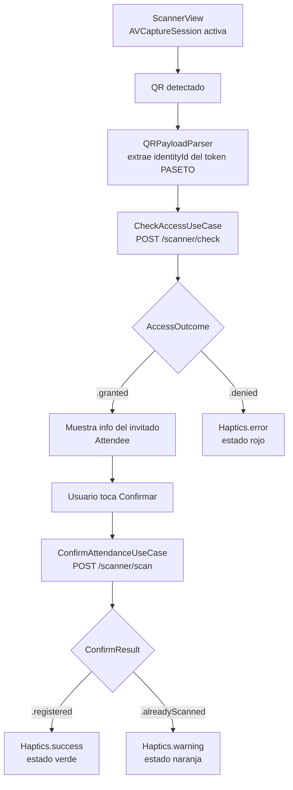
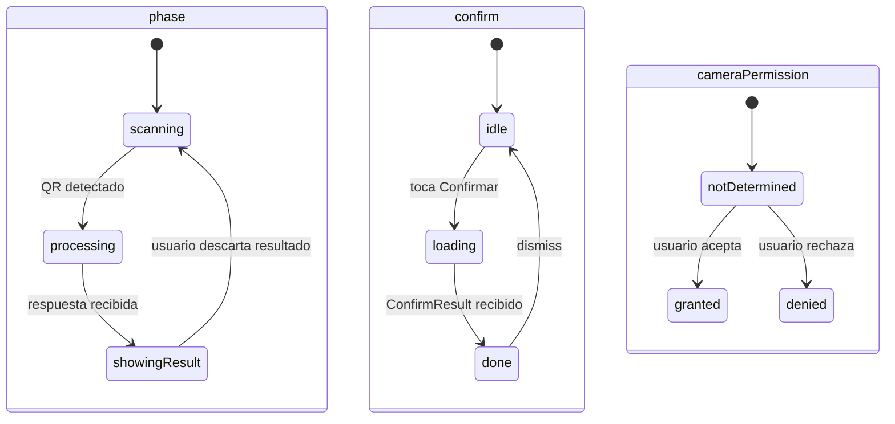

# Feature: Scanner

Valida acceso de invitados mediante QR en dos pasos: verificar y confirmar.

## Endpoints

```
Paso 1 — Verificar:   POST /api/v1/scanner/check
Paso 2 — Confirmar:   POST /api/v1/scanner/scan
```

---

## Flujo de escaneo



---

## Estados del ViewModel



---

## QR Parsing

`QRPayloadParser` soporta dos formatos:
1. **Token PASETO** — extrae `identityId` del payload JSON interno (base64 decode del segmento de claims)
2. **String directo** — fallback para strings con prefijo `idn_*`

---

## Funcionalidades

- Control de linterna (`torch on/off`)
- Gate de permisos de cámara (`CameraPermissionGate`) — guía al usuario a Configuración si deniega
- Animación de frame QR durante escaneo activo
- Re-escaneo automático al descartar resultado

---

## Archivos clave

| Archivo | Responsabilidad |
|---------|-----------------|
| `Scanner/Domain/Entities/AccessOutcome.swift` | Resultado de verificación (.granted, .denied) |
| `Scanner/Domain/Entities/ConfirmResult.swift` | Resultado de confirmación (.registered, .alreadyScanned) |
| `Scanner/Domain/UseCases/CheckAccessUseCase.swift` | Paso 1: verificar QR |
| `Scanner/Domain/UseCases/ConfirmAttendanceUseCase.swift` | Paso 2: confirmar asistencia |
| `Scanner/Domain/QRPayloadParser.swift` | Extrae identityId de PASETO o string directo |
| `Core/Camera/CameraController.swift` | Protocolo `CameraController` — abstrae AVFoundation |
| `Core/Camera/AVCameraController.swift` | Implementación concreta con `AVCaptureSession` |
| `Scanner/Application/ScannerViewModel.swift` | Máquina de estados del flujo de escaneo |
| `Scanner/Presentation/ScannerView.swift` | UI — recibe `CameraController` vía inyección |
| `Scanner/Presentation/Components/ResultSheetView.swift` | Sheet con info del invitado y botón Confirmar |
