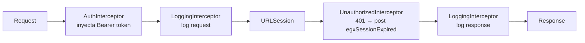

# Networking

## APIClient

```swift
protocol APIClient: Sendable {
    func send<Response: Decodable>(_ endpoint: Endpoint<Response>) async throws -> Response
}
```

`DefaultAPIClient` implementa:
- Pool de `URLSession` por timeout (preserva conexiones HTTP/2)
- Decodificación automática con `keyDecodingStrategy = .convertFromSnakeCase`
- Cadena de interceptores
- Retries con backoff exponencial
- Mock data con retardo simulado de 600ms

---

## Endpoint

```swift
Endpoint<MiResponse>(
    path: "/api/v1/ruta",
    method: .get,              // .get | .post | .put | .delete
    requiresAuth: true,
    domain: "MiFeature"        // usado en logs
)
```

Parámetros opcionales: `query`, `headers`, `body`, `timeout`, `retryPolicy`, `fallback`, `mockResult`, `wrapInBaseResponse`.

---

## Cadena de interceptores



Cada interceptor implementa `APIInterceptor`:
- `willSend(request:)` → modifica o enriquece el request antes de enviarlo
- `didReceive(response:data:for:)` → inspecciona la respuesta
- `didFail(error:for:)` → maneja errores de transporte

---

## Retry

| Parámetro | Default |
|-----------|---------|
| maxRetries | 2 |
| initialDelay | 0.5s |
| backoffMultiplier | 2.0x |
| maxDelay | 4.0s |

Reintenta en: timeout, conexión perdida, sin conexión, errores 5xx. No reintenta en 4xx.

Configuración custom por endpoint:

```swift
Endpoint<T>(
    path: "/ruta",
    retryPolicy: RetryPolicy(maxRetries: 3, initialDelay: 1.0, backoffMultiplier: 2.0, maxDelay: 8.0)
)
```

---

## Logging

- **Debug**: loguea método, URL, status code y body completo de cada request/response.
- **Release**: solo `os_log` nivel `.debug` — filtrado por iOS, invisible al usuario.

---

## Entornos y mock

| Modo | Red | Descripción |
|------|-----|-------------|
| `.development` | ✅ | URL del xcconfig (`Config/Debug.xcconfig`) |
| `.mock` | ❌ | Respuestas hardcodeadas, retardo simulado 600ms |

Activar mock: `Injection.setup(apiConfiguration: .mock)` en `EGXStaffApp.swift`.

URL llega al código via: `Config/Debug.xcconfig` → `Info.plist (APIBaseURL)` → `AppConfig.apiBaseURL` → `APIConfiguration.development` → `DefaultAPIClient`.
